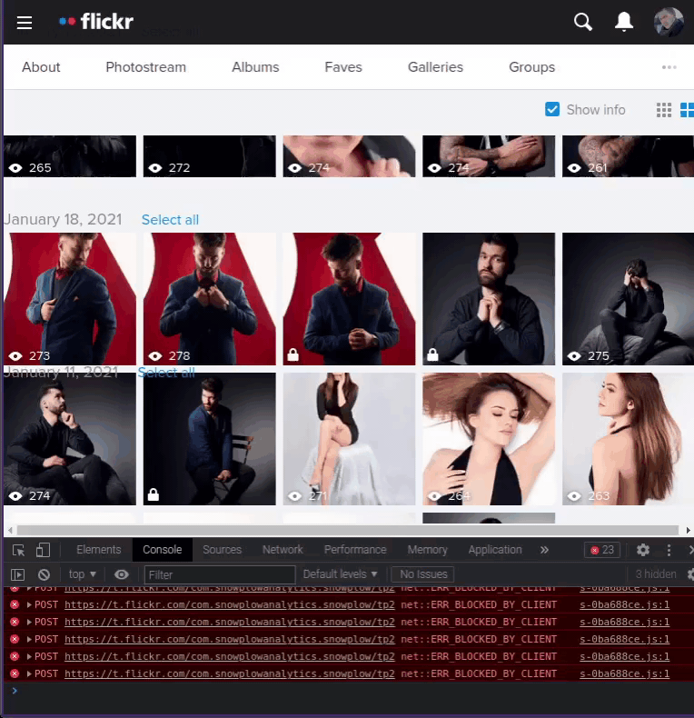

<!-- markdownlint-configure-file { "MD004": { "style": "consistent" } } -->
<!-- markdownlint-disable MD033 -->
#

    
     
    <strong>Sync your selected images upload date with creation date</strong>

<!-- markdownlint-enable MD033 -->

The Flickr Date Sync is a simple Javascipt open-source code, that provides function to synchronize dates in Flickr's Camera Roll section.

- **Easy-to-execute**: just copy content of [code.js](https://raw.githubusercontent.com/Atryni/flickr-date-sync/master/code.js) and paste in console
- **Free**: open source software which helps ensure _you_ are the sole person in control

-----

# Why this project was created?
When uploading photos to a Flickr website, we don't always have control over the order in which the photos are inserted. By sending them in reverse order or wanting to rearrange the photos in chronological order, we currently don't have any tool to help us sort photos quickly. Additionally, the problem is that the default snapping of photos for visitors to our website is after the date of sending.
The solution to synchronizing upload to creation date and times for each individual photo in our collection is to run an automation script.

# How to use it?
- [copy this code to clipboard](https://raw.githubusercontent.com/Atryni/flickr-date-sync/master/code.js)
- open your [Flickr's Camera Roll](https://flickr.com/cameraroll) site
- select images that you want to sync
- open console by clicking F12, paste and execute code
- wait for final result, where code will sync exery single picture that you selected

# How does it work?
The code is based on actions performed by automation programs such as Selenium. The code has defined fields that it searches on our website and performs the actions of clicking, copying and pasting texts for us.

# Is it safe?
Yes, code is safe to use. It doesn't break Flickr's TOS either (uses the tools provided by Flickr, only faster and for us). The code cannot access pages from other tabs. Going to another page as well as refreshing it resets the console and the code running in it.